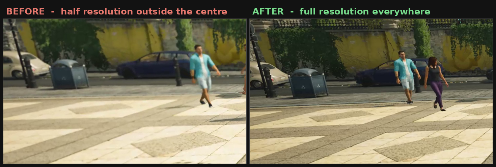
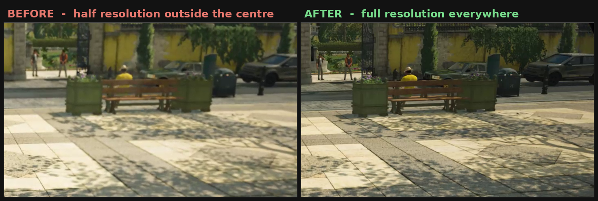

# HitmanVRFoveationFix

**Edge-to-edge sharpness for HITMAN World of Assassination in PC VR.**

If the middle of the image looks sharp and everything around it turns to mush, this fixes that.

Windows **v1.4** also fixes the eye-to-eye mismatch that could make glass, flowing water, bottles and some lights look different in each eye.

There was one more wrinkle: simply reducing the renderer to two views also caused angle-dependent geometry pop-in around glass. v1.4 avoids that by keeping the normal four-view renderer for geometry and visibility, while using only the two physical eye views for the two `CopyRefractionDepth` calls.

It also has a small renderer guard for the brief save-load window where the game could restore the old values and bring the black foveation circles back.

The difference is easiest to see on pancake-lens headsets such as **Quest 3 and Quest Pro**. Their lenses stay sharp much farther towards the edges, so when the edge is blurry, you are mostly looking at the game's software blur.

It works on Fresnel headsets too — Quest 2, Quest 3S, Rift S — but the difference is harder to see because the lenses already blur the edges.

PC VR only. This does **not** work with the standalone version.

Both VR backends are supported and tested:

- **Oculus** — Quest via Link or Air Link, Rift S
- **SteamVR / OpenVR** — including headsets connected through Steam Link, Virtual Desktop or their normal PC streaming software

---

## See the difference

Both crops come from the **outer part of the view**, from the same spot and at original resolution.

This is the part of the image you are looking through whenever you move your eyes away from dead centre. Which, unsurprisingly, happens quite a lot.





Look at the wall texture, ivy, paving stones, dappled shadows and the pictograms on the bins.

Same scene. Same settings. Same headset.

---

## Download and run

### Windows

1. Download `HitmanVRFoveationFix.ps1` and `HitmanVRFoveationFix.bat`
   — keep both files in the same folder
2. Double-click **`HitmanVRFoveationFix.bat`** and accept the administrator prompt
3. Start HITMAN however you normally do, including straight into VR
4. Play

Leave the small window open while you play.

It tells you what the tool is doing:

- grey: waiting for HITMAN
- amber: VR or the mission is still loading
- **green: the fix is active**
- red: something went wrong, and the window tells you what

The normal UI and lifecycle loop runs every 15 ms.

Once the renderer has been fully validated, v1.4 starts a separate sleeping guard which checks only two tiny pieces of renderer state: the 16-byte scale field and the 8-byte mask field, roughly once per millisecond.

If those bytes are already correct, it does nothing.

If they change, the guard hands control back to the same full validation, ownership, write, verification and rollback path used by the normal loop. There is no second "just write it and hope" code path hiding underneath.

### Why a .bat and not an .exe

Reading another program's memory is what debuggers do.

It is also what malware does.

Packed PowerShell executables therefore have a habit of making antivirus software very excited, regardless of what is actually inside them. Shipping one would mostly result in me asking people to click past a virus warning. Great first impression.

So this comes as a plain PowerShell script instead. Open it in any text editor and you can see what it does.

The `.bat` is one line. It only starts the script sitting next to it.

---

### Linux / Proton

**Linux port status:** experimental.

This is a Linux/Python port of the Windows/PowerShell **v1.3** release.

Development and testing were done by **GREYBE4RD**, with assistance from ChatGPT, on:

- Arch Linux
- SwayWM / Wayland
- SteamVR
- AMD Radeon RX 9070 XT

Nothing in the port is supposed to depend specifically on that distro or GPU, but it has not been tested across every Linux distribution, desktop environment, graphics card and VR setup in existence. Expect some variation.

1. Download `Linux-HitmanVRFoveationFix-v1.3.py` and `launch.linux.HitmanVRFoveationFix-v1.3.sh`
   — keep both files in the same folder
2. Make the launcher executable:

   ```bash
   chmod +x launch.linux.HitmanVRFoveationFix-v1.3.sh
   ```

3. Run it:

   ```bash
   ./launch.linux.HitmanVRFoveationFix-v1.3.sh
   ```

4. Enter your `sudo` password when asked
5. Start HITMAN however you normally do, including straight into VR
6. Play

Leave the terminal open while you play.

Press `Ctrl+C` to stop the fix and restore any live changes.

The Linux version reports the same states in the terminal.

> Linux/Proton/SteamVR: v1.3 replaces the timing-sensitive v1.2 reload logic and has been visually tested in the headset across new missions, mission restarts and save-game loads. It uses the same v1.3 patches and renderer values as the Windows version, with Linux process-memory access replacing the Windows APIs.
>
> Proton can restore the renderer scale and mask values during a save-game load faster than the normal 15 ms lifecycle loop can catch them, so the Linux port also runs a 1 ms guard. That guard uses the same validated render-value routine, synchronization and rollback handling as the main loop, and any writes still go through the existing v1.3 reload lifecycle.

The launcher itself is deliberately boring. It changes to the script's folder and starts `Linux-HitmanVRFoveationFix-v1.3.py` with the privileges needed to access HITMAN's process memory.

---

## What it actually does

HITMAN renders VR using **fixed foveation**.

Instead of rendering one full-resolution image for each eye, it renders four layers per frame:

- two **wide** layers at half resolution, covering the whole field of view
- two **narrow** layers at full resolution, covering only a small circle in the centre

Outside that circle, the image comes from the half-resolution layer and gets scaled up.

On a headset sharp enough to show it, the result is basically a small sharp island surrounded by blur.

And the sharp circle does not follow your eyes. It stays fixed in the middle of the image.

Move your eyes away from the centre and you are looking at the blurry part.

This tool changes that to **two full-resolution layers covering the entire field of view**.

The wide/narrow split is gone.

There is one complication.

HITMAN still expects four logical views for geometry and visibility. v1.4 keeps that four-view behaviour, as v1.3 did, but limits the refraction-depth copy to the two physical eye views.

That stops the narrow foveal views leaking into transparent materials without bringing back the geometry pop-in.

### What does it cost?

About **twice the pixel work**.

Before:

- four slices at 936 × 1008

After:

- two slices at 1872 × 2016

The field of view is the same. The renderer is pushing roughly twice as many pixels.

In my testing the frame rate held up because the game was not GPU-bound at these resolutions.

That does **not** mean the extra pixels are free. It just means my test setup had enough GPU headroom to get away with it.

The useful comparison is pixel density:

| | pixels | across | density |
|---|---|---|---|
| old sweet spot | 936 | ~49° | 19.1 px/° |
| now, everywhere | 1872 | 99° | 18.9 px/° |

That is about one percent apart.

So the old sharp centre already had basically the right pixel density. The problem was that HITMAN only gave it to a small circle in front of you.

Now you get roughly that density across the whole view.

No resolution setting is changed. You do not need to raise anything.

---

## Is it safe?

There are two different questions hiding in that word.

### Does it modify the game permanently?

No.

- **No game file or setting is modified.**
- Renderer changes are made only in the memory of the running HITMAN process.
- Close HITMAN and the operating system throws that process memory away.
- The tool writes a small `foveationfix.log` next to the script containing timestamps and renderer state changes. You can delete it whenever you like.

The tool also refuses to continue if:

- the game code is not in the state it expects
- VR is already running when it attaches
- the VR device does not look the way it expects

When you stop the tool, it restores the bytes owned by that instance when they are still safe to touch.

v1.4 briefly pauses HITMAN's threads, checks that none of them is currently inside a replaced call block or wrapper, restores the outer refraction hook first, then restores the remaining owned bytes.

Closing HITMAN itself always removes every in-memory change anyway.

### Is there zero risk?

No, and I am not going to pretend there is.

**This tool writes to the memory of a game that has an online connection.**

That has been fine in testing. You should still know it before deciding whether you want to run it.

There is no magic renderer checkbox hidden in an `.ini` file here. Changing what this renderer does means changing the renderer while the game is running.

The fix was verified on build **3.270.1**.

On other builds, the tool searches for both the v1.3 base sites and all three v1.4 refraction call blocks using strong byte patterns.

Both inner calls must resolve to the same `CopyRefractionDepth` target.

If something is missing, ambiguous or inconsistent, the tool stops.

It does not guess.

---

## To IO Interactive

If anyone at IOI reads this: please take it.

No permission needed. No credit needed. No strings attached.

The original sharpness fix is five instructions and three values.

v1.4 adds two things:

- `CopyRefractionDepth` is limited to the physical eye count
- the two renderer values which can be restored during loading are continuously watched and repaired

The details are in [`docs/HOW-IT-WORKS.md`](docs/HOW-IT-WORKS.md).

Two full-resolution layers instead of four half-resolution ones means roughly twice the pixel work, but it also looks dramatically better on modern headsets.

On the hardware I tested, there was enough GPU headroom that the extra work did not hurt the frame rate.

It would make a very nice patch note.

---

## Reporting a problem

If the tool does not turn green, or something looks wrong, please
[open an issue](https://github.com/RealChrizzl/hitman-vr-foveation-fix/issues).

Include **the exact wording shown in the window**.

Grey, amber and red mean different things, and the message usually tells me where things went wrong.

If that is not enough, there is a read-only diagnostic tool in [`tools/`](tools/).

Put `HitmanVRProbe.ps1` and `HitmanVRProbe.bat` in the same folder, start HITMAN, enter VR and load into a mission. Then double-click the `.bat` and press **Copy report**.

Probe v1.1 also reports whether every live v1.3 base-code site is:

- stock
- fixed
- unexpected

A foveation value of zero is displayed correctly.

The v1.4 refraction wrappers also monitor their own owner/count telemetry in the main tool and write a compact summary to `foveationfix.log`.

The probe imports only:

- `OpenProcess`
- `ReadProcessMemory`
- `CloseHandle`

There is no write function in it at all.

So the probe cannot modify the game even in principle.

---

## For the curious

- [`docs/HOW-IT-WORKS.md`](docs/HOW-IT-WORKS.md) — how HITMAN's foveation works, what the fix changes and how I found it
- [`docs/UPDATING.md`](docs/UPDATING.md) — how to find everything again if a future game update breaks the pattern search

You do not need either document to use the tool.

They are there for people who see "process memory patching" and immediately want to know exactly which bytes are getting bullied.

---

## Credits

Made by **RealChrizzl**.

This took roughly twenty hours of reverse engineering.

A large part of the disassembly work was done with **Claude Opus 5** and **Sol 5.6**. I ran the tests, wore the headset and made the calls about what actually looked right.

A model cannot put on a Quest 3 and tell me whether the glass is broken in the left eye.

To be bloody honest: without AI I would not be here sharing software.

---

## Licence

MIT — see [`LICENSE`](LICENSE).

Do what you like with it.

Fork it if I disappear one day.

That is rather the point.